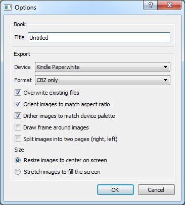

# Mangle

A couple of years ago I received an [Amazon Kindle](http://en.wikipedia.org/wiki/Kindle) gift. I immediately began
playing around with it and reading about certain undocumented features that the Kindle has to offer. After a couple of
hours I discovered it to be the perfect device for reading [Manga](http://en.wikipedia.org/wiki/Manga) is almost always
grayscale, and the aspect ratio fits the Kindle's 600x800 pixel screen almost perfectly. Better yet, the Kindle's
undocumented image viewer actually keeps track of the last image you viewed and thus you are always able to return to
the page you left off on when you power on your Kindle. The device supports several popular image formats (jpeg, png,
gif, etc), and is able to dither and downscale images to fit the screen.

However... The Kindle's image viewer does have certain shortcomings:

*   The Kindle is very picky about file format; any additional embedded data (thumbnails, comments, possibly even exif
    data) can confuse it. As a result, images may not display properly or even not at all (which actually prevents you
    from reading the given book, as one bad panel will prevent you from viewing subsequent images).
*   The first image that you view in a manga (until the Kindle first writes the "bookmark" file) seems to be arbitrary
    even when files are named sequentially.  About half the time it will correctly pick the first file in the batch, at
    other times it will pick out some other image seemingly at random.
*   Normally for Kindle to find your manga scans you have to press Alt+Z on the home screen. I haven't always had luck
    with it correctly identifying image directories. At other times, after finding an image directory the Kindle will
    appear to hang while trying to access it (forcing you to return to the home screen).
*   The Kindle image viewer has no functionality to rotate images. So if there is a horizontally large image (such as
    what often happens with dual-page scans), it can be difficult to make out the text because the image is simply
    scaled to fit (consequently leaving a lot of wasted space at the bottom of the screen).
*   Scanlation images are oftentimes much larger than the 600x800 screen; not only does this make them take more space
    on your memory card but it also slows down image loading (the Kindle has to read more data off of the slow SD card
    and scale the image). Scanlations often also include color scans of covers and inserts which take up more space than
    a grayscale equivalent (which is would be fine for the Kindle's limited display).
*   Kindle's image viewer provides no way to sort images (to determine in which order they are shown). This can be very
    problematic especially considering that scanlation groups have differing naming conventions, and as a result files
    from later chapters may appear before earlier ones when you are reading your manga (spoilers ftl).

I was annoyed with these issues and thus Mangle was born (the program name is a mix of "Manga" and "Kindle" in case you
haven't figured it out yet; I thought it was pretty clever at the time). Fortunately you can get all the benefits of my
work without really doing anything (and it won't even cost you anything since Mangle is free,
[GPL](http://www.gnu.org/licenses/gpl-3.0.txt) software.  With Mangle you can easily:

*   Sort and organize images from different directories; bulk rename feature for output to the Kindle.
*   Optionally re-save images in a format Kindle will be sure to understand with no visible quality loss.
*   Downsample and rotate images for optimal viewing on Kindle, convert to grayscale to save space and improve contrast.
*   Automatically generate book meta-data so that your manga is always properly detected and viewable in-order.

Here is a recent screenshot showing off some of the export options that you can configure on a per-book basis in Mangle:

You can also check out what Mangle output looks like on the Kindle on the [action
shots](http://foosoft.net/projects/mangle/action.html) page.

Mangle is cross platform, and doesn't require an install (it's a standalone executable that you can run from anywhere).
It is also "environmentally friendly" by not messing with your registry or modifying your system in any way.  If you
ever want to uninstall it, just delete the executable and you're done.

## Usage Instructions

Mangle is pretty easy to use, so this won't be really in-depth. If you have any questions drop me a line though.

1.  Add images to the current book by selecting the "Book | Add | Files" or "Book | Add | Directory" menu items.
2.  If certain images are not in the order you want, select them in the window, and select the "Book | Shift | Up" or
    "Book | Shift | Down" menu items.
3.  Configure the book title and image processing options by selecting "Book | Options"; this will be the title you see
    in the Kindle home menu.
4.  Create a root-level directory on your SD memory card/Kindle called "pictures" (case might matter).
5.  Once you are satisfied with the your images and options select "Book | Export" and select the "pictures" directory
    you just created.
6.  After the export is complete your new manga books will show up along with all your other books (if they don't for
    some reason, press Alt+Z while on the home menu).

## The Usual Disclaimer

You probably know how this goes by now... Mess around with your Kindle at your own risk. Honestly, nothing bad is going
to happen; however if something *does* then it's your problem.

## Running From Source

Because Mangle is written in Python, a scripting language, it's trivial to get it up and running on the operating system
of your choice. First you should make sure that you have the required dependencies installed:

* [PyQT4](http://www.riverbankcomputing.com/software/pyqt/download)
* [Python 2.7](http://www.python.org/download/releases/2.7/)
* [Python Imaging Library (PIL)](http://www.pythonware.com/products/pil/)
* [ReportLab](https://pypi.python.org/pypi/reportlab)
* [natsort](https://pypi.python.org/pypi/natsort/3.0.1)
* [py2exe](http://www.py2exe.org/) (optional, for Windows distribution only)

Now you can fetch the [latest version of the code](https://github.com/FooSoft/mangle/) and run the `mangle.pyw` script
to execute Mangle.

## Downloads

The Windows binary for the latest version of Mangle can be [downloaded
here](http://foosoft.net/projects/mangle/index/mangle_win.zip). Although I don't have the means to make MacOS X releases
myself, I do have the slightly older [MacOS X Package](http://foosoft.net/projects/mangle/index/mangle_osx.zip) built by
Rob White. *Note that I have never used MacOS X and I have no idea what it takes to get Mangle up and running on it so I
cannot answer any questions about that platform*.

